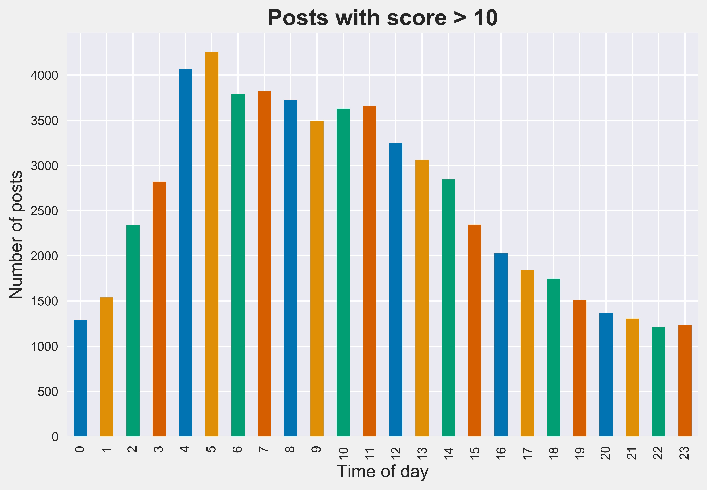
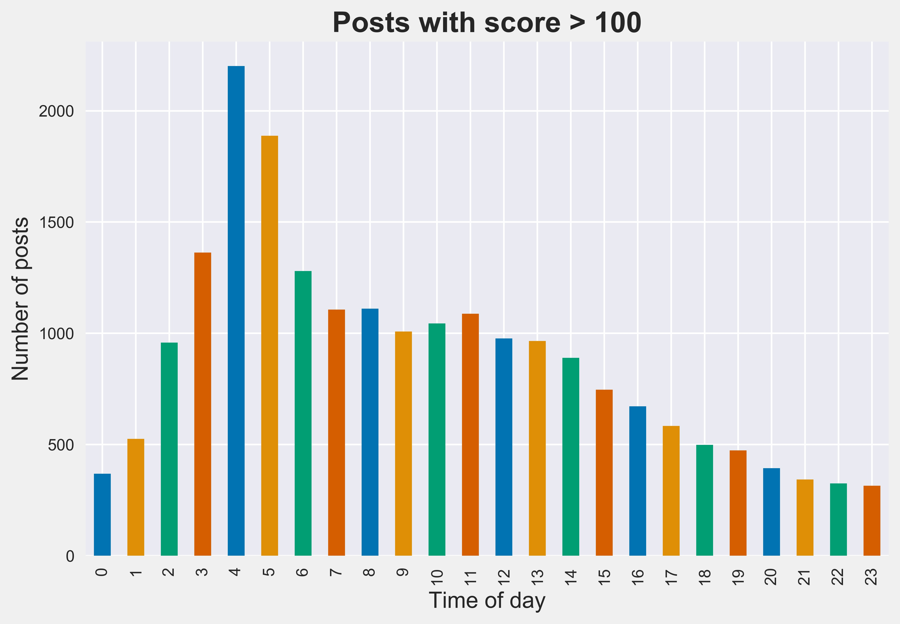

# REDDIT
## Collecting 5-years' worth of post information from the r/science subreddit and follow-up exploratory data analysis! 

The r/science subreddit is a forum where users can post about, and discuss, developments in any field of science. Users interact with such posts by 'upvoting' them, which is a way of expressing interest in the content of the submission.

The idea here was to collect information about all the posts from the r/science subreddit over the last 5 years (01/01/2015 to 04/21/2020, to be precise), and try to identify the common characteristics of posts that get a lot of visibility (i.e., posts with a high number of upvotes).
### Why is that important? 

To do so, I set out to collect the following information associated with posts on that subreddit: 
* Username of the poster
* Date and time of post
* Field of science relating to the submission (optional)
* Flair (optional). Flair is a way for the poster to display educational credentials, which is usually highest degree achieved, followed by field of said degree. These credentials are verified by the moderators of the forum.
* Upvotes, i.e. our metric for positive reaction to the post, and a measure of how much visibility it achieved.

## Data collection

In order to collect the data, the [Reddit API](https://www.reddit.com/dev/api/) seemed like the obvious choice. Unfortunately, the official API does not enable users to collect post data within a specified date range, which is where the [Pushshift API](https://pushshift.io/api-parameters/) came in handy. Pushshift is a big data project that copies and stores Reddit submissions as they are posted on the website, and its API enables users to retrieve data from a specific date range. 

Using it, I was rapidly able to retrieve data for the ~ 250,000 posts that were made to the r/science subreddit in that 5-year span. A major caveat was that Reddit data, and specifically, the all-important upvotes, are dynamic –– meaning that the data retrieved from Pushshift was largely inaccurate. Luckily, to each Reddit submission is associated a static, unique identifier, which can be used to retrieve up-to-date, accurate information on these posts from the official Reddit API.

Unfortunately, the maximum number of calls that any given user can make to the Reddit API is set to 60 requests per minute, or 3600 requests per hour. A back-of-the-enveloppe calculation rapidly pointed to the fact that getting the desired data on the 250k posts of interest would take close to 3 days. With limited time on my hands, I decided to create 10 separate Reddit user accounts, which would each process a chunk of ~25k posts of the parent dataframe in parallel –– thus reducing data collection to an overnight operation.

### Insert scheme to show the data collection process

## Exploratory data analysis

In no particular order, a few of the interesting insights from this data.

### Some fields are more interesting to the community than others.

A quick glance shows that of the 250k posts of interest, ~150k have a field specified, with ~800 distinct fields. The average score per field was calculated by first extracting the sum of the scores of all posts for a given field, and then dividing that by the number of posts made to that field. 

Interestingly, the traditionally 'soft' sciences, such as psychology, economics, social science, and epidemiology, fare better than 'hard' sciences, such as mathematics or computer science. One possible explanation for this, is the fact that results from groundbreaking research in psychology or economics tend to have far more relatable and direct implications on the average person's life, than comparably novel work in mathematics. 

Of note, posts that have received a sufficient number of upvotes in a relatively short window tend to make it to the 'front page' of Reddit, where they will be visible to anyone who opens Reddit, and not just people that browse the r/science subreddit. This leads to a feeback loop of sorts, whereby posts that gain a lot of traction early on in the r/science subreddit, get subsequently exposed to a much wider array of people by appearing on the 'front page', which results in further upvotes.

### Posts by PhDs score higher.

Of the ~250k posts analysed, approximately 11k of them were made by authors who chose to disclose their educational credentials. Though this disclosure is optional, it has to be verified by moderators of the forum before it is displayed to the general public.

Authors that did disclose their educational credentials scored more highly, on average, than those who did not. Posts from authors holding a Bachelor's degree did not fare significantly better than those by Master's degree holders. On the contrary, authors with a PhD fared better than Bachelor's or Master's degree holders, while Professors did on average, significantly better than any of the other categories.

Hence, the level of educational attainment of the author seems to be correlated with the average score of the posts. This makes sense, in that people specialists are more likely to catch wind of ground-breaking research earlier on than the average person, and have a better ability to summarise the key results in a succint fashion that is understandable for the lay person. In addition, access to peer-reviewed articles tends to be prohibitively expensive, unless one is affiliated with a university.

Conversely, voters may well be more likely to trust conclusions presented to them by authors who have disclosed a high level of educational attainment, which would play a role in the correlation observed.

### Time of submission matters.

Given that the timing of upvotes is an important contributor to Reddit's ranking algorithm (and hence, on the exposure that a post gets), it should come as no surprise that the time of submission plays an important role on how well a post does.

When segmenting the posts by score (>0, >100, >1000), it appears that there is a disproportionately large number of high scoring posts that are submitted around 4am PST. 

   
 

A likely explanation for this trend is that posting at 4am PST corresponds to the moment when users on the East Coast are waking up (+3 hours), and when users in Europe are having lunch (+8 hours). Those users are likely to be browsing for new content on the website at that time, resulting in upvotes shortly after posting, which in turn leads to a prefential treatment by Reddit's ranking algorithm.

